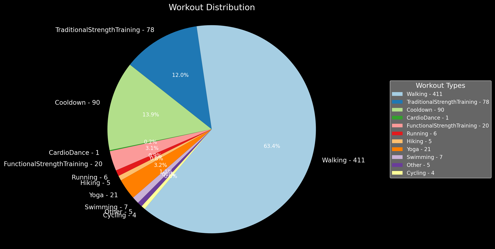

In May 2022, a vision took shape in my mind: to simplify my daily trips, be it a casual walk or a gym workout, armed with nothing more than my keys, AirPods, and an Apple Watch. This wasn't just a thought; it was a deliberate lifestyle choice. So, after meticulous planning, I embraced this vision by equipping myself with a stainless steel cellular Apple Watch Series 7.

## Preamble

The first days with the watch felt great, you have to customize the watch experience in order to get the most out of it. You can create multiple watch faces for different occasions, for example, I have a modular watch face for everday use and sports one for workouts. You also have to customize the notifications and the focus mode in order to avoid unnecessary distractions.

|  | 
|:--:| 
| *[Apple Watch rings documentation](https://support.apple.com/en-ca/guide/watch/apd3bf6d85a6/watchos)* |

On the Apple Watch, the daily activity is measured with three rings. The red ring tracks active calories burned, the green one monitors exercise minutes, and the blue ring indicates how frequently you've moved for at least a minute per hour.

A few days prior to January, I decided to set a goal for myself: to close all three rings every day for a year. I knew it would be a challenge and I tried completing a week just to see but I was determined to see it through.

## The Journey Begins

In the first weeks I just followed a simple routine of walking every afternoon, mechanically, just to close the rings. I always loved walking but I had to go the extra mile to close the rings. A few weeks later, I started to feel the benefits of walking. I was more energetic, I was sleeping better and I was more focused. This isn't just an observation on my end but a clear representation thanks to the statistics on the watch for my resting heart rate and sleep cycles. I was walking more than ever but I was feeling less tired. The days where I was active enough to close the rings without walking felt like I didn't do anything at all.

## The Highs and Lows

The Apple Watch is a great companion and even though the standing notifications can be annoying at times, it is a great reminder for our predominantly desk-bound lifestyle. The watch is also the best alarm clock I have ever used. The haptic feedback is a gentle tap on your wrist and it is a great way to wake up in combination to a home automation routine that turns on the lights at a thousand kelvin.

The best experience was to walk on a sunny day on the south of France with nothing more than my keys, AirPods and my watch. I was able to listen to music, track my workout and pay for my croissant with just my watch. It was a great feeling to be able to do all without being weighed down by my phone.

However, the watch is not perfect. The battery life, while being capable of fast charging, is not enough for more than a day. At some point you have to get used to carry an extra cable in the car, for longer trips, just in case. The watch also has badges and challenges but sometimes the monthly challenge can become out of reach if your previous month was super active and there are no rest days.

## The gamification of fitness

While the badge challenges can get out of hand, the gamification of fitness is a great way to keep you motivated. The badges are incremental steps that you can look forward to and the monthly challenges are a great way to keep you on your toes. The watch also has a social aspect to it. You can share your activity with your friends and compete with them. I have to admit that I was a bit skeptical about this feature but I have a few close friends that I compete with and it is a great way to keep each other motivated.

## Data Analysis

Diving into the data, I analyzed my 2023 workout logs extracted from the Health app. Through some xml parsing and data manipulation, I created a visual representation of my workout patterns. Unsurprisingly, walking dominated as my primary activity throughout the year.

## Conclusion

Completing the three rings for a year has been a great challenge and fantastic discipline exercise. If you're considering the watch, I highly recommend it based on my experience. It is a great companion and a great way to keep you motivated. I am looking forward to the next year and I am planning to keep the streak going for as long as it continues to bring value to my daily routine.

Thank you for reading my thoughts on this year long experience. You can also read my previous posts on [Apple Music is the last library focused music service](https://erdaltoprak.com/blog/apple-music-is-the-last-library-focused-music-service/) and [AI Homelab: A guide into hardware to software considerations](https://erdaltoprak.com/blog/ai-homelab-a-guide-into-hardware-to-software-considerations/).